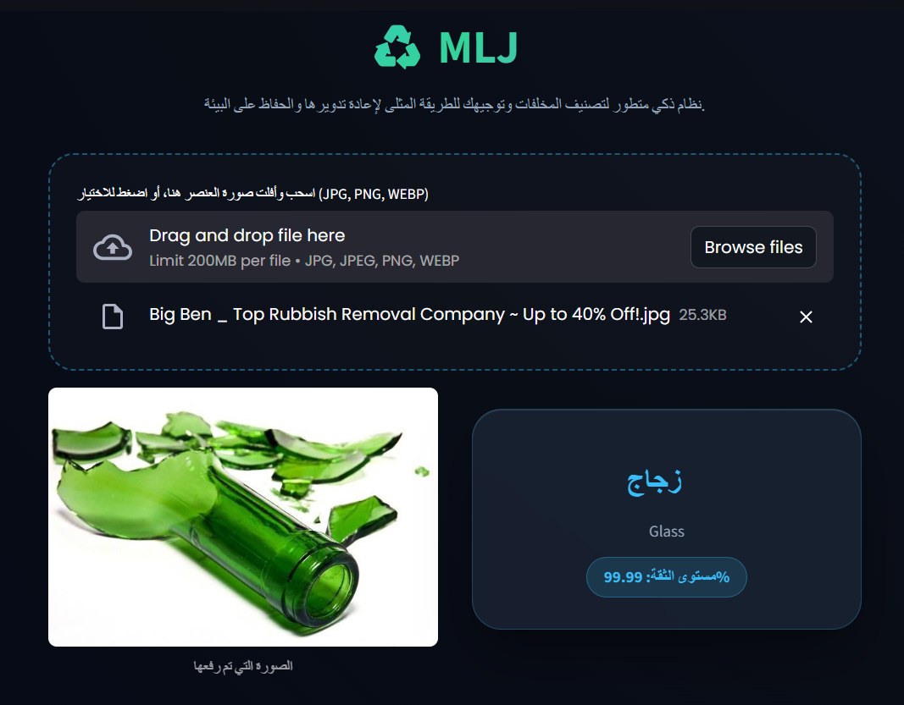
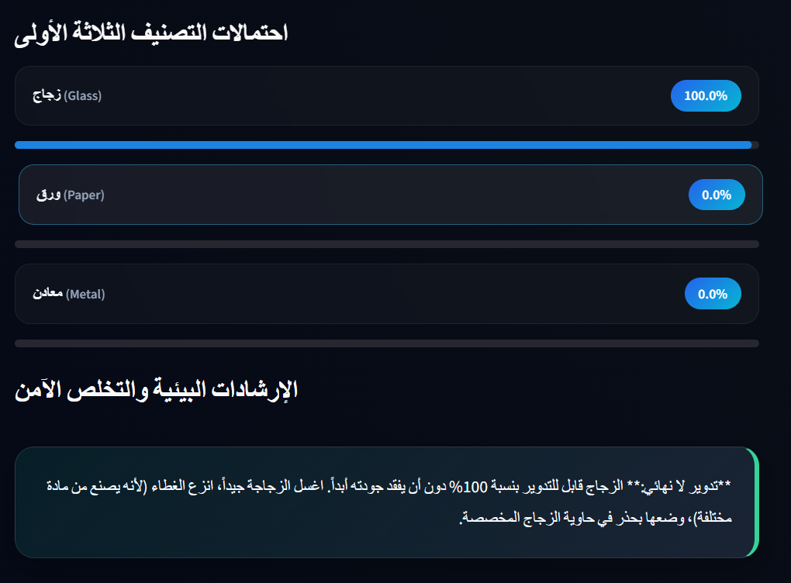
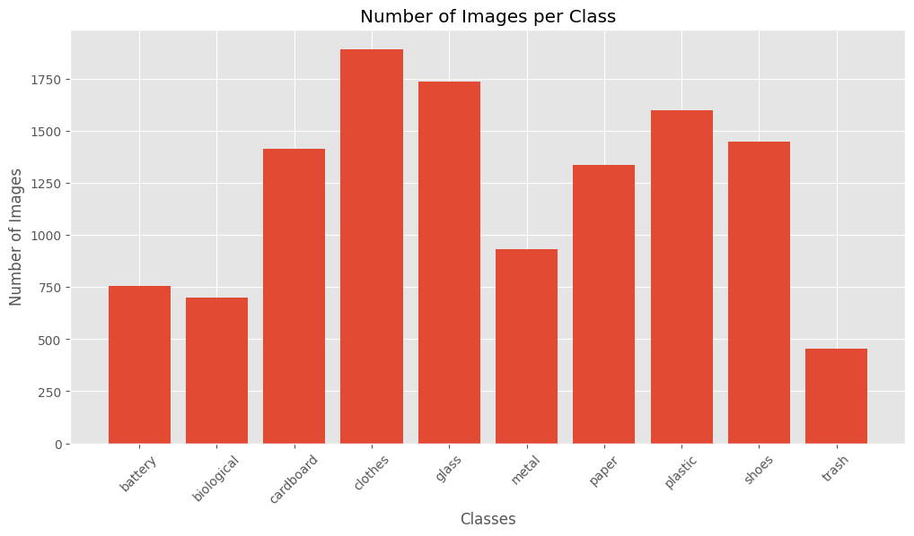
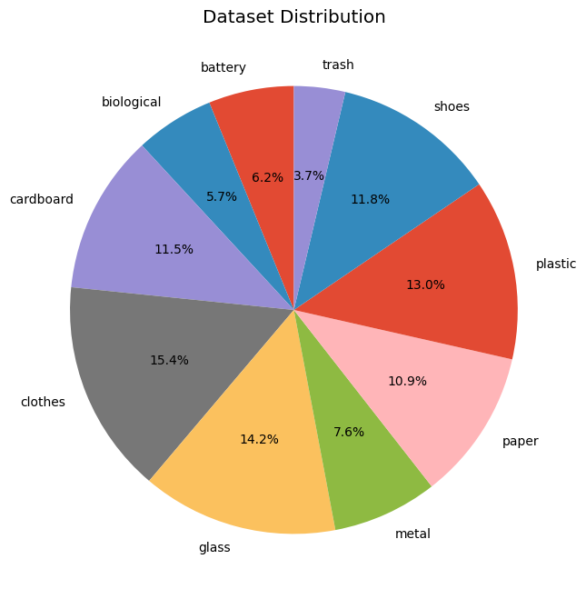
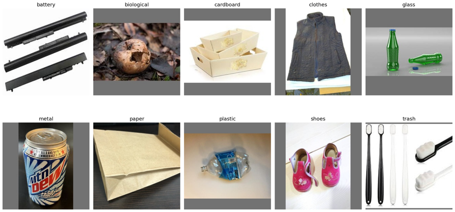
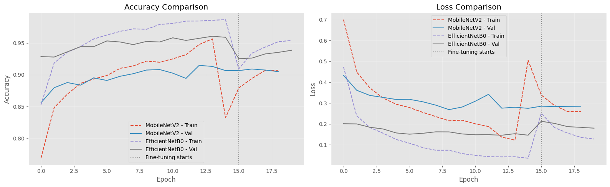
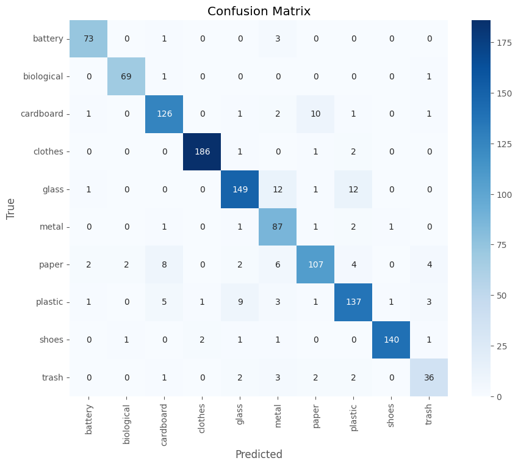

# MLJ — Garbage Classification

A deep learning project that classifies waste images into **10 categories** using transfer learning, wrapped in an interactive **Streamlit** app that predicts the category and returns a practical, Arabic-language disposal and recycling tip based on the result.

---

## Table of Contents

- [Overview](#overview)
- [Live Demo](#live-demo)
- [Dataset](#dataset)
- [Exploratory Data Analysis](#exploratory-data-analysis)
- [Methodology](#methodology)
- [Results](#results)
- [Streamlit App](#streamlit-app)
- [Project Structure](#project-structure)
- [Getting Started](#getting-started)
- [Reproducing Training](#reproducing-training)
- [Tech Stack](#tech-stack)
- [License](#license)

---

## Overview

Waste sorting is one of the simplest, highest-leverage steps in recycling — but people often aren't sure which bin an item belongs to. This project trains an image classifier to recognize **10 waste categories** and wraps it in a simple web app: upload a photo, get the category, and get a short, practical tip (in Arabic) on how to dispose of, recycle, or reuse that specific item.

Two CNN architectures were trained and compared using transfer learning:

| Model | Base | Approach |
|---|---|---|
| **MobileNetV2** | ImageNet weights | Frozen base → head training → fine-tuning last 30 layers |
| **EfficientNetB0** | ImageNet weights | Frozen base → head training → fine-tuning last 30 layers |

---

## Live Demo

The app is live and ready to try — upload a photo of a waste item and get an instant prediction with a confidence score, the top-3 candidate classes, and a tailored disposal tip in Arabic.

**[Try the live app →](#)**

<p align="center">
  
</p>

The app also breaks down its confidence across the top-3 predicted classes and follows up with clear, actionable disposal guidance for the identified material.

<p align="center">
  
</p>

> Replace the link above with your deployed app URL (Streamlit Community Cloud, Hugging Face Spaces, or your own hosting).

---

## Dataset

- **Source:** [Garbage Classification v2](https://www.kaggle.com/datasets/sumn2u/garbage-classification-v2) (Kaggle), `standardized_256` variant.
- **Classes (10):** `battery`, `biological`, `cardboard`, `clothes`, `glass`, `metal`, `paper`, `plastic`, `shoes`, `trash`.
- **Total images:** ~11,259, unevenly distributed across classes (453–1,892 images per class).
- **Split:** 80% train / 10% validation / 10% test, via `split-folders` with a fixed seed for reproducibility.

<p align="center">
  
</p>
<p align="center">
  
</p>

Because the dataset is imbalanced (e.g. `clothes` has roughly 4x more images than `trash`), **class weights** (`sklearn.utils.class_weight.compute_class_weight`, `balanced`) were computed and passed to `model.fit()` so the model doesn't just learn to favor the majority classes.

### Sample images per class

<p align="center">
  
</p>

A quick integrity pass (`PIL.Image.verify()`) was also run over the full dataset to check for corrupted files before training.

---

## Exploratory Data Analysis

The notebook (`notebooks/garbage-classification.ipynb`) includes a full EDA pass:

- Per-class image counts and distribution plots (bar and pie chart)
- Random sample grid across all 10 classes
- Image dimension check (confirms all images are pre-standardized)
- File extension audit
- Corrupted image scan

---

## Methodology

**Preprocessing and augmentation** (`ImageDataGenerator`):
- Rescale/normalize (`1./255` for MobileNetV2, `preprocess_input` for EfficientNetB0)
- Rotation (±20°), width/height shift (±10%), horizontal flip, zoom (±15%), brightness jitter (0.8–1.2)
- Input size: `224×224`, batch size `32`

**Transfer learning, in two stages, for each architecture:**
1. **Head training** — base model frozen, only the custom head (`GlobalAveragePooling2D → Dense(256, relu) → Dropout(0.3) → Dense(10, softmax)`) is trained for up to 15 epochs with `Adam(lr=1e-3)`.
2. **Fine-tuning** — the last 30 layers of the base model are unfrozen and trained for up to 10 more epochs with a much smaller learning rate (`Adam(lr=1e-5)`) to gently adapt the pretrained features to this dataset.

**Callbacks used throughout:**
- `EarlyStopping` (patience 5, restores best weights)
- `ReduceLROnPlateau` (factor 0.5, patience 3)
- `ModelCheckpoint` (saves best model by validation accuracy)

---

## Results

<p align="center">
  
</p>

| Model | Test Accuracy |
|---|---|
| MobileNetV2 | **89.3%** |
| EfficientNetB0 | **91.5%** |

**Confusion matrix — MobileNetV2 (test set):**

<p align="center">
  
</p>

Most confusion happens between visually similar categories — `glass` vs `metal`/`plastic`, and `paper` vs `cardboard` — which is expected given overlapping shapes, colors, and packaging materials.

---

## Streamlit App

`app.py` provides a simple UI to try the model interactively:

1. Upload a photo (JPG, PNG, or WEBP) of a single item.
2. The app runs it through the selected model (MobileNetV2 or EfficientNetB0) and shows the predicted class with a confidence score, plus the top-3 predictions.
3. Based on the predicted class, it shows a **practical tip in Arabic** on how to correctly dispose of, recycle, or reuse that specific type of waste (e.g. batteries → hazardous-waste drop-off points; glass → wash and recycle indefinitely; clothes → donate if wearable, textile-recycling bins if not).

See the [Live Demo](#live-demo) section above for screenshots of the app in action.

---

## Project Structure

```
garbage-classification/
├── app.py                      # Streamlit inference app
├── requirements.txt
├── LICENSE
├── README.md
├── notebooks/
│   └── garbage-classification.ipynb   # full training & EDA notebook
├── assets/                     # images used in this README / app
└── models/                     # put your trained .keras model(s) here (gitignored)
    ├── mobilenetv2_garbage_classifier.keras
    └── efficientnetb0_garbage_classifier.keras
```

---

## Getting Started

```bash
# 1. Clone the repo
git clone https://github.com/<your-username>/garbage-classification.git
cd garbage-classification

# 2. Create a virtual environment (recommended)
python -m venv venv
source venv/bin/activate    # Windows: venv\Scripts\activate

# 3. Install dependencies
pip install -r requirements.txt

# 4. Add your trained model
#    Place mobilenetv2_garbage_classifier.keras and/or
#    efficientnetb0_garbage_classifier.keras inside models/

# 5. Run the app
streamlit run app.py
```

The app will open at `http://localhost:8501`.

> **Note on the model file:** trained `.keras` model weights are not included in this repository (they're large binary files, kept out via `.gitignore`). Train the model using the notebook and drop the resulting `.keras` file(s) into `models/` (see filenames above), or host them externally (Hugging Face Hub, Google Drive, Git LFS, or a GitHub Release) and download them on app startup.

---

## Reproducing Training

The full pipeline — data loading, EDA, splitting, augmentation, training both architectures, fine-tuning, evaluation, and a Gradio demo — is in [`notebooks/garbage-classification.ipynb`](notebooks/garbage-classification.ipynb). It was originally built and run on Kaggle against the `garbage-classification-v2` dataset; update `DATASET_PATH` at the top of the notebook to point to your local copy of the dataset to reproduce the results.

---

## Tech Stack

- **TensorFlow / Keras** — model architecture, transfer learning, training
- **MobileNetV2 / EfficientNetB0** — ImageNet-pretrained backbones
- **scikit-learn** — classification report, confusion matrix, class weighting
- **split-folders** — reproducible train/val/test splitting
- **Streamlit** — interactive web app for inference
- **Pandas / Matplotlib / Seaborn** — EDA and result visualization

---

## License

Released under the [MIT License](LICENSE).
